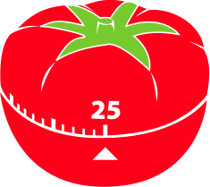
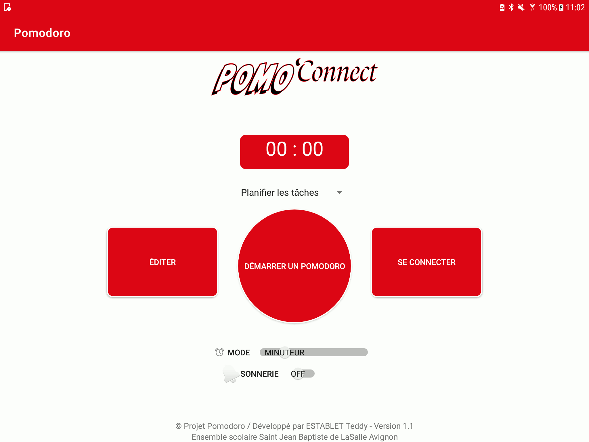
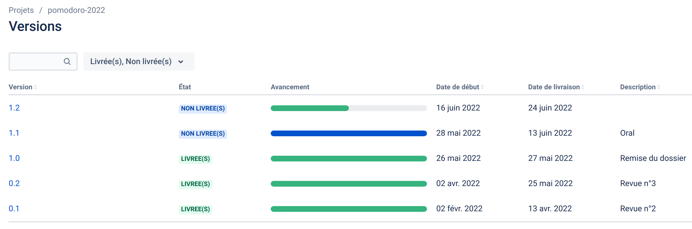
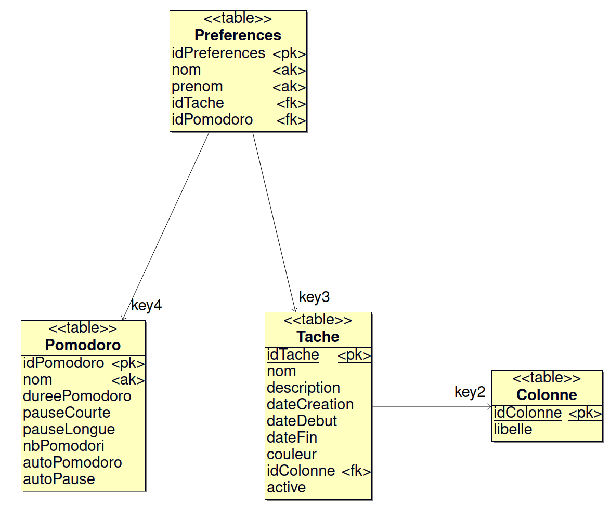

# Le projet pomodoro-2022

- [Le projet pomodoro-2022](#le-projet-pomodoro-2022)
  - [Minuteur connecté](#minuteur-connecté)
  - [Fonctionnalités](#fonctionnalités)
  - [TODO](#todo)
  - [Historique des versions](#historique-des-versions)
  - [Documentation du code](#documentation-du-code)
  - [Base de données](#base-de-données)
  - [Protocole](#protocole)
  - [Diaporama](#diaporama)
  - [Auteur](#auteur)
  - [Kanban](#kanban)

La **technique Pomodoro** est une technique de gestion du temps développée par Francesco Cirillo à la fin des années 1980. Cette méthode se base sur l'usage d'un minuteur permettant de respecter des périodes de 20 minutes appelées pomodori (qui signifie en italien « tomates »).

Francesco Cirillo propose une approche se basant notamment sur un minuteur mécanique. L’idée du projet est donc de conserver un “objet concret” pour en faire un minuteur connecté.

Le système est composé :

- d’un minuteur connecté (ESP32, écran tactile, avertisseur sonore et éventuellement boutons)
- d’une tablette tactile (Android) pour le pilotage à distance et la gestion des tâches

## Minuteur connecté

- Version simulateur :

## Fonctionnalités

- Gérer un pomodoro (démarrer, arrêter, ...)
- Afficher l'état du minuteur
- Éditer une tâche
- Configurer les minuteries (la longueur des pomodoros, des pauses courtes et des pauses longues, mode manuel ou automatique)
- Dialoguer avec le minuteur connecté
- Activer/Désactiver l'alarme sonore
- Notifier les événements

## TODO

- [ ] Enregistrer le suivi des tâches (statistiques)

## Historique des versions

- Version 1.1 : 10/06/2022
- Version 1.0 : 27/05/2022
- Version 0.2 : 25/05/2022
- Version 0.1 : 13/04/2022

## Documentation du code

https://btssn-lasalle-84.github.io/pomodoro-2022/

## Base de données

## Protocole

- [Protocole POMODORO 2022.pdf](docs/Protocole%20POMODORO%202022%20.pdf)

## Diaporama

- [Revue de projet final - Teddy ESTABLET.pptx](docs/Revue%20de%20projet%20final%20-%20Teddy%20ESTABLET.pptx)

## Auteur

- Version Mobile Android : Teddy Establet <<teddyestablet84@gmail.com>>

## Kanban

[pomodoro-2022](https://github.com/btssn-lasalle-84/pomodoro-2022/projects/1)

©️ LaSalle Avignon 2022
