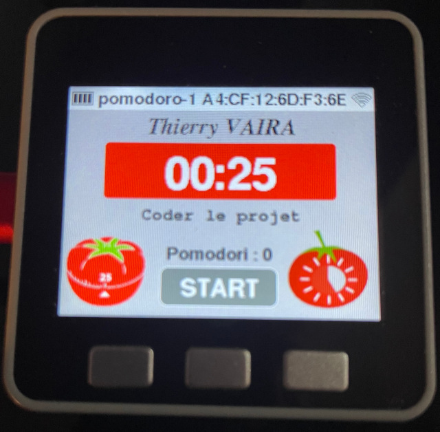

# Simulateur POMODORO 2022

- [Simulateur POMODORO 2022](#simulateur-pomodoro-2022)
  - [Configuration du simulateur](#configuration-du-simulateur)
  - [Protocole](#protocole)
  - [Fonctionnement](#fonctionnement)
  - [platform.ini](#platformini)
  - [Auteur](#auteur)

Ce document présente rapidement le fonctionnement du simulateur ainsi que le protocole implémenté. Le protocole complet est disponible dans Google Drive. Actuellement, la version du protocole est la **0.1** (11 avril 2022).



## Configuration du simulateur

Pour la simulation, les durées en minutes sont transformées en secondes :

```cpp
#define DUREE_POMODORO        25 //1500 // 25 minutes
#define PAUSE_COURTE_POMODORO 5  //300  // 5 minutes
#define PAUSE_LONGUE_POMODORO 20 //1200 // 20 minutes
#define NB_POMODORI           4
```

## Protocole

Les éléments de base du protocole :

```cpp
#define PERIPHERIQUE_BLUETOOTH  "pomodoro-1"
#define EN_TETE_TRAME           "$"
#define DELIMITEUR_CHAMP        ";"
#define DELIMITEURS_FIN         "\r\n"
#define DELIMITEUR_DATAS        ';'
```

Les différentes types de trame :

```cpp
enum TypeTrame
{
  Inconnu = -1,
  START, PAUSE_COURTE, PAUSE_LONGUE, ATTENTE, RESUME, STOP, RESET, SET, ALIVE, ACK, ERREUR, ETAT,
  NB_TRAMES
};
```

Le format général des trames est le suivant : `${TypeTrame}[;...]\r\n`

Chaque trame reçue entraîne l'envoi d'une trame d'acquittement `$ACK\r\n` ou d'erreur `$ERREUR;{CODE}\r\n` par le simulateur.

Les codes d'erreur :

```cpp
#define ERREUR_TRAME_INCONNUE       0
#define ERREUR_TRAME_NON_SUPPORTEE  1
#define ERREUR_TYPE_INCONNU         2
#define ERREUR_CONFIGURATION        3
```

La trame `ETAT` précise l'état du pomodoro : `$ETAT;{EtatPomodoro}\r\n`

Les différents états sont :

```cpp
enum EtatPomodoro
{
  EnAttente       = -1,
  Termine         =  0,
  EnCours         =  1,
  EnCourtePause   =  2,
  FinCourtePause  =  3,
  EnLonguePause   =  4,
  FinLonguePause  =  5,
  Gele            =  6,
  Reprise         =  7
};
```

La trame `SET` de configuration possède le format suivant : `$SET;{TypeConfiguration};[...]\r\n`

```cpp
enum TypeConfiguration
{
  Invalide = -1,
  TACHE, UTILISATEUR, POMODORO, SONNETTE,
  NB_TYPES_CONFIGURATION
};
```

Les possibilités de configuration sont :

```
$SET;UTILISATEUR;NOM;PRENOM\r\n

$SET;TACHE;NOM\r\n

$SET;SONNETTE;ACTIVATION\r\n

$SET;POMODORO;duree;pauseCourte;pauseLongue;nbPomodori;autoPomodoro;autoPause;mode\r\n
```

Le champ `mode` admet deux valeurs :

```cpp
enum Mode
{
  Minuteur = 0,
  Chronometre = 1
};
```

_Remarque :_ le mode `Chronometre` n'est pas géré actuellement. Les champs `autoPomodoro` et `autoPause` non plus.

## Fonctionnement

Pour l'instant, le simulatur ne fonctionne qu'en mode `Minuteur`.

## platform.ini

```ini
[env:m5stack-core-esp32]
platform = espressif32
board = m5stack-core-esp32
board_build.partitions = no_ota.csv
framework = arduino
lib_deps =
  # M5Stack
  1851
build_flags=-std=gnu++11
upload_port = /dev/ttyUSB0
monitor_port = /dev/ttyUSB0
monitor_speed = 115200
```

## Auteur

- Thierry Vaira <<tvaira@free.fr>>
